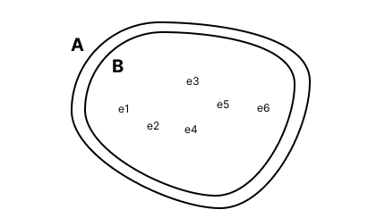

import Exersize from './_01_exersize.mdx'

# 集合論

TypeScriptを勉強する前にちょっとばかし集合論について復習です。

集合論とは、値の集まり、例えば数値の集まりなどを扱う数学の分野（？）で、その値の集まりの性質などを扱います。

TypeScriptでは集合論が密に関わっていて、集合論の言葉で言い表すとTypeScriptのルールを簡潔にすることができます。

ここで必要なのは集合論の中でも基礎中の基礎、簡単な部分だけなのであまり身構えずに聞いてもらえればなと思います。

## 定義 集合(Set)

集合(Set)とは、値の集まりのことである。

たとえば"one", 2, "three" のみを含む集合は以下のようにして表す。

-  $\{”one”, 2, ”three”\}$

集合とは値の集まりを表現するものであり、順番に意味はないため以下のようにしても上と同じである（=で結んでもOK）。

- $\{2, ”three”, ”one”\}$

集合は以下の様な「値を囲む枠線（区域）」として図に表されることが多い。

## 定義 要素(元)(Element)

集合の中に入っている値一つ一つを要素(Element)という。また、元とも呼ばれる。

ある値eが集合Sの要素（元）であることを以下のように表す。

$$
e \in S 
$$

例)

$$
”three” \in \{”one”, 2, ”three”\}
$$

## 定義 空集合(Empty set)

要素の個数が0個である集合を空集合と呼ぶ。
この時、単純に$\lbrace \rbrace$と書いたり、特別に$\emptyset$もしくは$\phi$と書いたりする。

## 定義 部分集合(Sub set)

任意の値xが集合Aの要素であるならば集合Bの要素でもある時、AはBの部分集合（Subset）といい、以下のように表す。

$$
A \subset B
$$

数学的な記法で定義を書くならこんな感じ。

$$
A \subset B := \forall x, x\in S \Rightarrow x \in S'
$$

$A \subset B$の図を書くならこう。

## 定理

空集合は任意の集合の部分集合である。

## 定義 集合の等しさ(Equality)

集合$A, B$があって、$A \subset B$かつ$B \subset A$である時、$A$と$B$は等しいといい、$A = B$で表す。

より厳密に数学的な記法で定義を書くならこんな感じ。言っていることは上と同じこと。

$$
A = B := \forall x, x \in A \iff x \in B 
$$

難しく考えず言えば、普通にAとB中身が同じということです。

（図にする上でBがAの中にあるかの様に書きましたがそこに意味はなく、AとBの間に要素がないことが重要です）

## 定義 和集合(Union)

二つの集合 A, B に対して $A \cup B = \{x | x \in A\ or\ x \in B\}$ とおいて、これをAとBの和集合という。

例として、$A = \{1, 3, 4, 6\}, B = \{2, 3, 4, 5\}$なら

$A \cup B = \{1, 2, 3, 4, 5, 6\}$

以下が成り立つ。

- 結合律（法則）: $(A \cup B) \cup C = A \cup (B \cup C)$
- 交換律（法則）: $A \cup B = B \cup A$

## 定義 交叉（共通部分）（Intersection）

二つの集合A, Bに対して $A \cap B = \{x | x \in A, x \in B\}$とおいて、これをAとBの交叉という。

例として、$A = \{1, 3, 4, 6\}, B = \{2, 3, 4, 5\}$なら

$A \cap B = \{3, 4\}$

以下が成り立つ。

- 結合律（法則）: $(A \cap B) \cap C = A \cap (B \cap C)$
- 交換律（法則）: $A \cap B = B \cap A$

## 練習問題

<Exersize />
