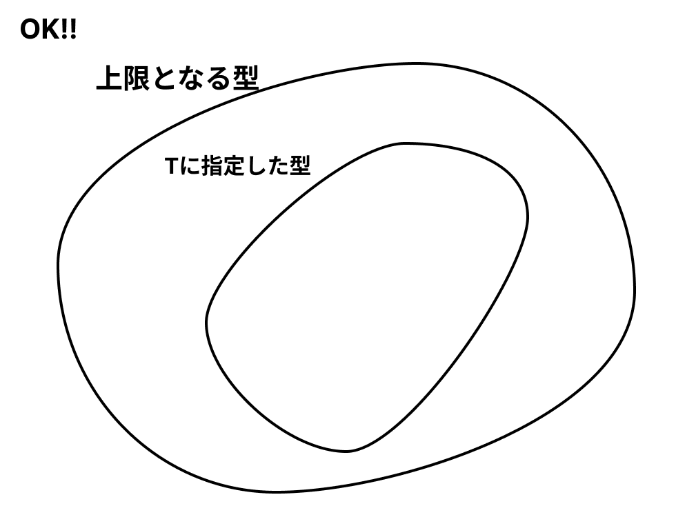
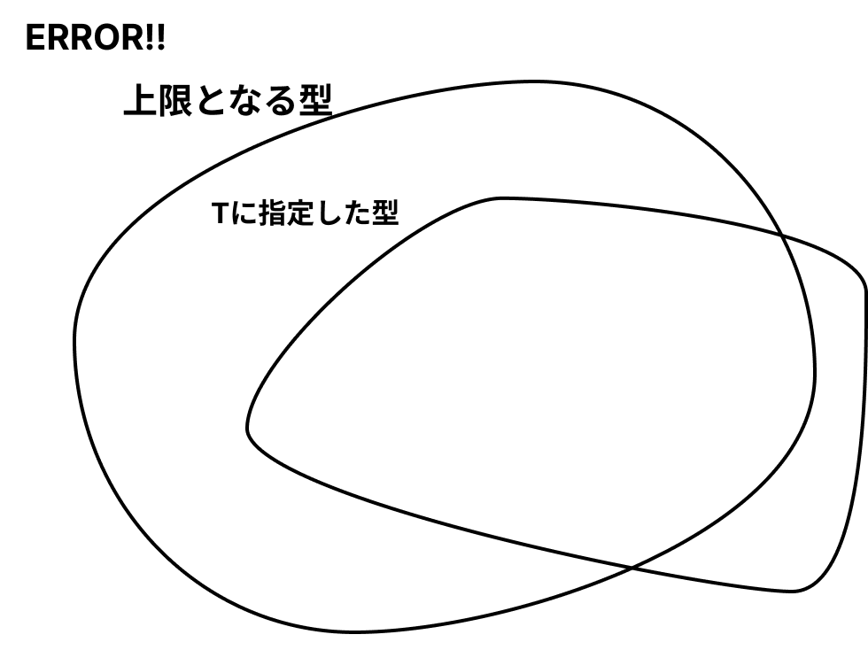

# ジェネリクス

引数に受け取った値をそのまま返す関数idを作成してください。引数の型は、そうですねぇ、直近でnumberで使う予定なのでnumberにしてみてください。

```typescript!
function id(x: number): number {
    return x
}
```

ふむふむ余裕余裕。次にあなたの上司が、「id関数をstringでも使いたい」と駄々を捏ねてきました。あなたはしょうがないなぁと言いながらこの関数に手を加えます。

```typescript!
function id(x: number | string): number | string {
    return x
}
```

とりあえずstringを渡すことはできる様になりました。しかしこれでは返り値の方が`number | string`なので例えばnumberとして扱うことができなくなってしまいました。

それでは困ってしまうので、あなたは天才的な発想によりnumberとstringそれぞれ`stringId`と`numberId`関数を実装することにしました

```typescript!
function numberId(x: number): number {
    return x
}

function stringId(x: string): string {
    return x
}
```

...今後様々な種類のオブジェクトや配列、numberの部分型などなど、合わせて100種類ものid関数を実装させられるとは、この時はまだ、誰も知らなかった...。

というわけで生まれたのがジェネリクスくん（言語によってはジェネリックとも）。

:::info
詳しい経緯なんて知らないので、説明しやすく言ってるだけです。ひっ、叩かないでっ
:::

ジェネリクスは、型の上で多態性 / 多相性（ポリモーフィズム）を表現するための手法です。その中でも特にパラメトリック多相と呼ばれるものを表現します。

:::info
wikipedia: [ポリモーフィズム](https://ja.wikipedia.org/wiki/%E3%83%9D%E3%83%AA%E3%83%A2%E3%83%BC%E3%83%95%E3%82%A3%E3%82%BA%E3%83%A0) より引用

パラメトリック多相を使うと、値の型に関係なく「一様に」値を扱うことで、関数やデータ型を総称的に記述できるようになる。パラメトリック多相は言語の静的な型安全性を保ちながら表現力を向上させる手法のひとつである。
:::

こればっかしは見てみないと分かりませんので実際のコードをドン

```typescript!
function id<T>(x: T): T {
    return x
}
```

この`<T>`というのがジェネリクスの宣言です（名前はTじゃなくてもなんでもいい）。そして宣言したジェネリクスはそのスコープにおいて使用可能な型となります。

すなわち関数idはT型を受け取ってT型を返す関数なわけです。...T型ってなんすか？

ジェネリクスだとピンとこないかもしれませんが、これは別名型パラメータなどとも呼ばれます。パラメータとは変数です。ここまでいえば感のいい人はわかったと思います。

そう、引数として型を指定することができるのです！するとどうでしょう。id関数は１つしか実装していないのに様々な型に対応できています！

```typescript!
id<string>("aaa") // 結果はstring型
id<number>(123)// 結果はstring型
id<{ name: string }>({ name: "eraser" })
```

この様に、型をパラメータとして扱うことによって一つの定義で柔軟な表現をする、というのがジェネリクスのアイデアです。

もちろんジェネリクスは複数宣言も可能です。以下は第一引数に第二引数の関数を適応する関数applyの実装例です。

```typescript!
function apply<T, U>(
    a: T,
    f: (x: T) => U
) {
    return f(a)
}
```

## ジェネリクスの上限指定

ジェネリクスには上限となる型を指定できます。上限というのは指定できる一番広い集合という意味です。上限を指定されたジェネリクスにはその部分型のみを指定できる様になります。





プログラムではこの様に書いて上限を指定します。

```typescript!
// 上限がstringの例
function a<T extends string>(x: T): T {
    return x
}

a<string>("hoge")          // OK!
a<"hoge" | "fuga">("hoge") // OK!
a<number>(1)               // ERROR! numberはstringの部分型ではない
```

