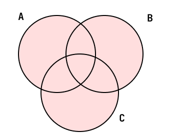
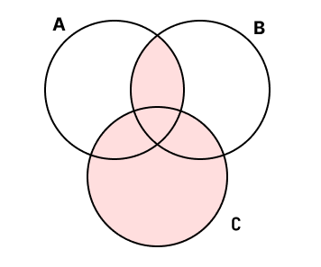

import Tabs from '@theme/Tabs';
import TabItem from '@theme/TabItem';

特に提出とかは求めません。解いてみて、答えを見て、理解できているか確認してみてください。

間違っていて、理解ができないのであれば、講師に質問してみるべきなのかもしれませんね。

<Tabs>

<TabItem value="summary" label="問題">

集合$A, B, C$について$A \cup B \cup C$を図に表してください

</TabItem>

<TabItem value="answer" label="答え">

</TabItem>
</Tabs>

<Tabs>

<TabItem value="summary" label="問題">

集合$A, B, C$について$(A \cap B) \cup C$を図に表してください

</TabItem>

<TabItem value="answer" label="答え">

</TabItem>
</Tabs>

<Tabs>

<TabItem value="summary" label="問題">

「$\{1, 4\}$ は $\{1, 3, 5, 7\}$の部分集合である」は真か偽か

</TabItem>

<TabItem value="answer" label="答え">

偽

証明）反例をあげる。4は$\{1, 4\}$の要素であるが$\{1, 3, 5, 7\}$の要素でないため部分集合の定義を満たさない。よって偽。

</TabItem>
</Tabs>
<Tabs>

<TabItem value="summary" label="問題">

$A \cap (B \cup C) = (A \cap B) \cup (A \cap C)$であることを確認してください（証明の必要はありません）

</TabItem>

<TabItem value="answer" label="答え">

確かめられたならそれでOKです。

</TabItem>
</Tabs>
